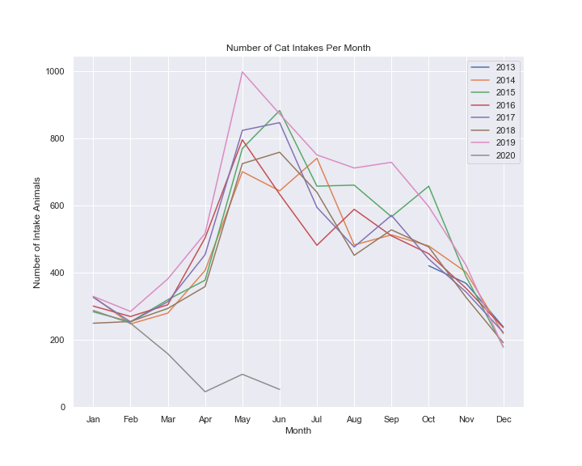

# Animal Center Needs Analysis

## Business problem:

Austin, Texas is the largest No Kill community in the nation, and home to the [Austin Animal Center](http://www.austintexas.gov/content/austin-animal-center). They provide shelter to more than 16,000 animals each year and animal protection and pet resource services to all of Austin and Travis County.

#### Questions of interest:

1. Can intake patterns be predicted, which would allow the Center to predict needs?
2. Are more or fewer animals coming in who need expensive spay/neuter surgeries, and thus would it be useful to do more community work to expand access to low cost spay/neuter programs?

## Data

The Austin Animal Center has the longest running public dataset of animal rescues in the country. Every animal has a unique id that ties to both their intake and outcome data when they enter and leave the shelter. 

| Data Download Links: |
| -------------------- |
| [Intake Data](https://data.austintexas.gov/api/views/wter-evkm/rows.csv?accessType=DOWNLOAD) |
| [Outcome Data](https://data.austintexas.gov/api/views/9t4d-g238/rows.csv?accessType=DOWNLOAD) |

Note: these links will directly download the relevant data.

## Findings & Recommendations

Please refer to the [narrative Jupyter Notebook](./animal_shelter_needs_analysis.ipynb) in this repository for a walkthrough and more explanation of these findings.

- Dog and cat intake is seasonal, so Center should predict and prepare for upticks in intake during spring/summer
- While infrequent, have staff be prepared for spikes in small animal care
- Neutering workload is predictable
- Neutered pets get adopted at higher rates, so continue to fix incoming dogs/cats
- Cats are less likely to come in already fixed, so Center may explore partnering with or otherwise expanding low-cost spay/neuter or Trap/Neuter/Release programs in the area

## Limitations & Next Steps

- Missing animals that came back to the shelter more than one time in the same year
- Not examining animals still in the shelter
- Do not know specific costs of care or current staffing of Center
- Consistent dips in January and December might be due to how we merged the data on year, so artifical dip

### Contact

For any additional questions, please reach out to the [Flatiron School's Data Science Program](https://flatironschool.com/career-courses/data-science-bootcamp): [LinkedIn](https://www.linkedin.com/school/the-flatiron-school/)

